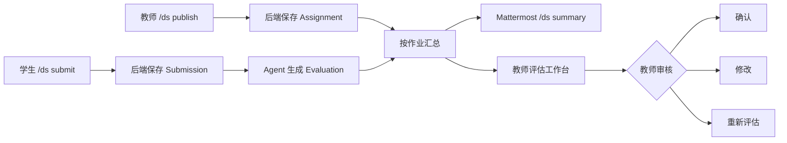

# TIDE 数据结构作业评估系统

一个面向数据结构课程的本地作业发布、提交、AI 辅助评估与教师审核 Demo。系统通过 Mattermost Slash Command 完成教师和学生交互，并提供网页端教师评估工作台。

## 已实现的完整流程



已支持：

- 教师通过 Mattermost 发布作业；
- 学生通过 Mattermost 提交文本、代码片段或伪代码答案；
- 提交后自动调用 Agent 生成结构化基础评估；
- 教师通过 Mattermost 查看作业汇总；
- Mattermost 汇总卡片支持“确认评估”和“重新评估”交互按钮；
- 教师在网页中确认、修改或重新评估；
- 教师工作台支持作业搜索、提交搜索、状态/等级筛选和多种排序；
- 教师工作台展示平均分、最高/最低分、等级分布和完整性分布；
- 教师工作台按提交展示不可变的 EvaluationAudit 评估历史时间线；
- Prisma + PostgreSQL 持久化；
- EvaluationAudit 记录 Agent 生成、教师修改、确认和重评历史；
- 六类 Agent 行为测试和 9 项正式 API 集成测试；
- 后端输出带请求 ID、耗时和业务事件的 JSON 结构化日志；
- backend、agent、frontend、PostgreSQL 容器健康检查；
- Mock 与 DeepSeek 两种 Agent 运行模式。

## 项目结构

```text
.
├─ backend/       Express + TypeScript + Prisma + API 集成测试
├─ frontend/      React + Vite
├─ agent/         FastAPI + Pydantic + OpenAI-compatible client
├─ tests/         六类验收测试与结果
├─ assets/        验收截图和演示素材
├─ scripts/       一键启动与数据库初始化脚本
├─ docker-compose.yml
└─ .env.example
```

## 环境要求

- Windows 10/11
- Docker Desktop
- Node.js 18 或更高版本（仅本地运行测试时需要）
- WSL2 + Ubuntu
- 已能运行的 Mattermost 本地开发环境

本项目当前使用的 Mattermost 源码路径为：

```text
/home/zhenhuan/code/mattermost
```

## 一、启动作业评估系统

在项目根目录复制环境变量：

```powershell
Copy-Item .env.example .env
```

编辑 `.env`。基础演示可保持：

```dotenv
POSTGRES_USER=postgres
POSTGRES_PASSWORD=password
POSTGRES_DB=tide_final
POSTGRES_PORT=5434

BACKEND_PORT=3001
FRONTEND_PORT=5173
AGENT_PORT=8000
FRONTEND_ORIGIN=http://localhost:5173

AGENT_MODE=mock
DEEPSEEK_API_KEY=your_api_key_here
DEEPSEEK_BASE_URL=https://api.deepseek.com
DEEPSEEK_MODEL=deepseek-v4-pro

MATTERMOST_SLASH_TOKEN=创建SlashCommand后生成的Token
MATTERMOST_TEACHER_USERNAME=你的Mattermost教师用户名
# 可选；Mattermost Server 能访问到的交互回调地址
MATTERMOST_ACTION_URL=
LOG_HEALTH_REQUESTS=false
```

推荐使用一键脚本启动：

```powershell
powershell -ExecutionPolicy Bypass -File .\scripts\start-demo.ps1
```

该脚本会检查 Docker、验证 Compose 配置、构建镜像、启动容器、自动应用 Prisma migration 和 seed，并等待三个 HTTP 服务可访问。Docker Hub 暂时不可访问但本地已有镜像时，脚本会自动回退到缓存镜像。

如果明确不需要重新构建，可执行：

```powershell
powershell -ExecutionPolicy Bypass -File .\scripts\start-demo.ps1 -NoBuild
```

也可以手动启动：

```powershell
docker compose up -d --build
docker compose ps
```

后端容器启动时会自动执行：

1. Prisma Client 生成；
2. 数据库迁移；
3. Seed 初始化；
4. 后端服务启动。

检查：

```powershell
docker compose ps
Invoke-RestMethod http://localhost:3001/health
Invoke-RestMethod http://localhost:8000/health
```

`docker compose ps` 中的 db、agent、backend、frontend 最终都应显示为 `healthy`。

页面与服务：

| 服务 | 地址 |
|---|---|
| 教师评估工作台 | `http://localhost:5173` |
| 后端健康检查 | `http://localhost:3001/health` |
| Agent 健康检查 | `http://localhost:8000/health` |
| Agent API 文档 | `http://localhost:8000/docs` |

后端宿主机端口使用 `3001`，避免与 Mattermost 开发环境的 Grafana `3000` 端口冲突。

## 二、启动和配置 Mattermost

进入 WSL：

```powershell
wsl -d Ubuntu
```

在 Mattermost 的 `server` 目录启动：

```bash
cd ~/code/mattermost/server
make run
```

不要在 `~/code/mattermost` 根目录运行 `make run`，该目录没有对应 target。

浏览器访问：

```text
http://localhost:8065
```

设置本地开发所需配置：

```bash
cd ~/code/mattermost/server
bin/mmctl config set ServiceSettings.SiteURL http://localhost:8065 --local
bin/mmctl config set ServiceSettings.AllowedUntrustedInternalConnections localhost,127.0.0.1 --local
```

确认 Slash Command 已启用：

```bash
bin/mmctl config get ServiceSettings.EnableCommands --local
```

应返回 `true`。

## 三、创建 `/ds` Slash Command

可在 Mattermost 集成页面创建，也可使用本地 `mmctl`：

```bash
cd ~/code/mattermost/server
bin/mmctl command create cuhksz \
  --local \
  --creator 你的Mattermost用户名 \
  --title TIDE-Assistant \
  --description TIDE-assignment-assistant \
  --trigger-word ds \
  --url http://localhost:3001/mattermost/commands \
  --response-username TIDE-Agent \
  --autocomplete \
  --autocompleteDesc TIDE-assignment-assistant \
  --autocompleteHint help-publish-submit-summary \
  --post
```

将命令生成的 Token 写入根目录 `.env`：

```dotenv
MATTERMOST_SLASH_TOKEN=生成的Token
```

Interactive Messages 的按钮回调地址默认根据 Slash Command 请求的 Host 自动生成。如果 Mattermost 无法访问自动生成的地址，可显式配置：

```dotenv
MATTERMOST_ACTION_URL=http://Windows主机在WSL中的可达IP:3001/mattermost/actions
```

该地址必须能从 Mattermost Server 所在的 WSL 环境访问，不能盲目填写 Mattermost Server 自己的 `localhost:3001`。

然后让后端读取新配置：

```powershell
docker compose up -d --force-recreate backend
```

不要把 `.env` 或真实 Token 提交到 Git。

## 四、角色与演示账号

Prisma Seed 中已有：

| 角色 | 后端用户名 | 用途 |
|---|---|---|
| 教师 | `teacher01` | 发布、汇总、审核 |
| 学生 | `student01` | 完整答案 |
| 学生 | `student02` | 部分正确答案 |
| 学生 | `student03` | 错误答案 |

当前本地 Mattermost 已建立：

| 角色 | Mattermost 用户名 | 本地演示密码 |
|---|---|---|
| 教师 | `zhenhuan` | 使用原管理员账号 |
| 学生 | `student01` | `TideStudent01!` |

`.env` 中通过下面配置把 Mattermost 教师映射到 Seed 教师：

```dotenv
MATTERMOST_TEACHER_USERNAME=zhenhuan
```

学生使用与 Seed 相同的用户名即可自动映射。

## 五、Slash Command 用法

查看帮助：

```text
/ds help
```

教师发布：

```text
/ds publish | 标题 | 2026-07-25 23:59 | 题目内容 | 其他说明
```

学生提交：

```text
/ds submit | assignment_id | 答案内容
```

教师汇总：

```text
/ds summary | assignment_id
```

学生提交成功后，系统会保存答案并自动请求 Agent。Agent 暂时失败时，提交不会丢失，教师可在网页端重新评估。

教师执行汇总后，每份已有评估的提交会显示两个 Interactive Messages 按钮：

- **确认评估**：直接确认当前分数并追加 `confirmed` 审计记录；
- **重新评估**：立即返回“已触发”提示，后台调用 Agent，完成后追加 `regraded` 审计记录。

按钮上下文使用 `MATTERMOST_SLASH_TOKEN` 生成 HMAC 签名；回调还会重新检查 Mattermost 用户映射和教师角色。修改分数与评语仍在网页端完成。

## 六、教师审核

打开：

```text
http://localhost:5173
```

先点击“刷新数据”，再从顶部下拉框核对当前作业。每份报告支持：

- **确认评估**：接受当前 Agent 结果；
- **修改结果**：修改分数、等级和评语；
- **重新评估**：再次调用 Agent，并递增报告版本。
- **查看评估历史**：展开该提交的 EvaluationAudit 时间线，核对操作类型、报告版本、分数、等级、状态、操作者和时间。

工作台还提供：

- 在顶部按作业标题或题目内容搜索作业；
- 按学生姓名、用户名或答案内容搜索提交；
- 按审核状态和等级筛选提交；
- 按提交时间、分数或学生姓名排序；
- 汇总已评估数量、平均分、最高分、最低分、等级分布和答案完整性分布。

统计与筛选均基于当前所选作业的数据，切换作业或点击“刷新数据”后会自动更新。筛选只改变前端显示，不修改数据库中的提交或评估。

前端默认可能停留在旧作业。操作前务必核对作业标题、学生和答案内容。

## 七、主要 API

| 方法 | 路径 | 用途 |
|---|---|---|
| GET | `/health` | 服务和数据库健康检查 |
| POST | `/assignments` | 教师发布作业 |
| GET | `/assignments` | 作业列表 |
| GET | `/assignments/:id` | 作业详情 |
| POST | `/assignments/:id/submissions` | 学生提交 |
| GET | `/assignments/:id/submissions` | 按作业汇总 |
| POST | `/submissions/:id/evaluate` | 生成基础评估 |
| GET | `/submissions/:id/evaluation` | 查询评估 |
| GET | `/submissions/:id/evaluation-audits` | 查询该提交的完整评估审计历史 |
| POST | `/evaluations/:id/confirm` | 教师确认 |
| PATCH | `/evaluations/:id` | 教师修改 |
| POST | `/evaluations/:id/regrade` | 教师要求重评 |
| POST | `/mattermost/commands` | Mattermost Slash Command 回调 |
| POST | `/mattermost/actions` | Mattermost Interactive Messages 安全回调 |

本作业只实现满足验收的轻量角色校验，没有实现 JWT 登录系统。

### EvaluationAudit 审计记录

系统在下列操作完成后追加不可变审计记录：

- `baseline`：迁移时保存已有评估的基线快照；
- `generated`：首次生成 Agent 评估；
- `modified`：教师修改评估；
- `confirmed`：教师确认评估；
- `regraded`：Agent 重新评估完成。

每条记录保存操作类型、评估版本、完整结果快照、Agent 原始输出、操作教师和时间。查询示例：

```powershell
Invoke-RestMethod `
  http://localhost:3001/submissions/你的提交ID/evaluation-audits |
  ConvertTo-Json -Depth 8
```

重评或学生重新提交不会覆盖已有审计记录；Evaluation 被替换时，历史仍按 Submission 保留。

## 八、运行验收测试

保持 Agent 容器运行，在项目根目录执行：

```powershell
node .\tests\run_acceptance_tests.mjs
```

预期：

```text
Acceptance cases: 6/6 matched documented behavior.
```

测试覆盖：

1. 正常完整答案；
2. 部分正确答案；
3. 明显错误答案；
4. 不完整或模糊答案；
5. Agent 误判；
6. 无法编译运行代码的能力边界。

详细结果见 [tests/TEST_RESULTS.md](tests/TEST_RESULTS.md)。

### 正式 API 集成测试

保持四个 Compose 服务运行，推荐将 Agent 设为 Mock 后执行：

```powershell
docker compose exec backend npm run test:api
```

预期：

```text
tests 9
pass 9
fail 0
```

测试覆盖健康检查与请求 ID、参数校验、角色权限、发布、提交、首次评估、重评、教师修改、确认、汇总、EvaluationAudit、Slash Token、交互按钮签名和有效回调。每次使用唯一作业 ID，结束后自动删除测试作业及其级联数据，不污染演示列表。

### 结构化日志

后端将日志以“一行一个 JSON 对象”写入标准输出：

```powershell
docker compose logs -f backend
```

常见事件包括：

- `http.request.completed`：请求 ID、方法、路径、状态码、耗时；
- `evaluation.started/completed/failed`：提交、版本、模型提供方、分数和耗时；
- `mattermost.command_received`：Slash 子命令和角色；
- `mattermost.action_received/completed`：交互按钮操作与教师身份；
- `mattermost.action_signature_rejected`：伪造或过期按钮上下文被拒绝。

日志不会记录 Slash Token、API Key 或完整请求体。Docker 探针请求默认不记录；如需排查可设置 `LOG_HEALTH_REQUESTS=true`。

## 九、Agent 模式

### Mock 模式

```dotenv
AGENT_MODE=mock
```

特点：

- 不需要网络和 API Key；
- 输出稳定，适合本地验收演示；
- 本质是关键词规则，不是通用语义模型。

### DeepSeek 模式

```dotenv
AGENT_MODE=live
DEEPSEEK_API_KEY=你的Key
DEEPSEEK_BASE_URL=https://api.deepseek.com
DEEPSEEK_MODEL=deepseek-v4-pro
```

修改后重建：

```powershell
docker compose up -d --build agent backend
```

在线模式使用结构化提示词、Pydantic 校验，并在输出校验失败时重试一次。

本项目验收环境已使用 `deepseek-v4-pro` 完成在线调用验证。DeepSeek 当前也支持
`deepseek-v4-flash`；如需降低调用成本，可在 `.env` 中切换模型并重新构建 Agent 与后端。

## 十、能力边界

- Mock 规则主要针对当前单链表反转样例；
- 不能可靠理解任意数据结构题；
- 通用文本评估不会编译或运行任意学生代码，也没有通用隐藏测试；
- CSC3100 杨辉三角专项评分器是明确例外：它会在受限子进程中执行官方有效提交，
  并使用管理者提供的 3 个公开测试点和 17 个隐藏测试点；
- 同义表达或纯中文表达可能被关键词规则误判；
- 堆叠正确关键词的错误代码可能获得高分；
- 在线模型输出仍可能不稳定；
- AI 结果只作辅助，最终结论由教师确认。

本次真实演示中，正确的括号匹配答案被 Mock Agent 评为 55/F，教师随后修改为 95/A，并成功执行重新评估。这一记录用于展示系统的真实能力边界。

## 十一、常见故障

### `SiteURL must be configured to use slash commands`

设置：

```bash
bin/mmctl config set ServiceSettings.SiteURL http://localhost:8065 --local
```

### `Command with a trigger of 'ds' failed` / `address forbidden`

设置仅限本机的集成白名单：

```bash
bin/mmctl config set ServiceSettings.AllowedUntrustedInternalConnections localhost,127.0.0.1 --local
```

### `Bind for 0.0.0.0:3000 failed`

Grafana 使用了 3000。本项目后端应保持：

```dotenv
BACKEND_PORT=3001
```

### `nc: bad address 'grafana'`

Mattermost 首次启动中断后，Grafana 可能没有加入 `mattermost-server_mm-test` 网络。检查：

```powershell
docker network inspect mattermost-server_mm-test
```

必要时把 `mattermost-grafana` 重新接入该网络并设置别名 `grafana`。

### 产品通知或安全更新超时

本地环境无法访问 Mattermost 外网服务时会出现警告，不影响核心 Demo。以页面是否能打开以及 `/api/v4/system/ping` 是否返回 `OK` 为准。

### Docker Hub TLS / x509 证书异常

如果 `docker compose up -d --build` 在拉取基础镜像元数据时出现：

```text
failed to fetch oauth token
tls: failed to verify certificate
x509: certificate is valid for another domain, not auth.docker.io
```

这是当前网络、代理或 DNS 导致的 Docker Hub 证书异常，不是项目代码构建失败。若本机已有之前成功构建的镜像，可先恢复服务：

```powershell
docker compose up -d --no-build
```

不要删除本地镜像或数据库卷。待网络恢复后再执行完整 `--build`。

## 十二、停止与数据保护

停止本项目：

```powershell
docker compose down
```

不要执行下面命令，除非明确要删除所有作业与评估数据：

```powershell
docker compose down -v
```

数据库使用命名卷持久化。重新启动不会丢失现有验收数据。
